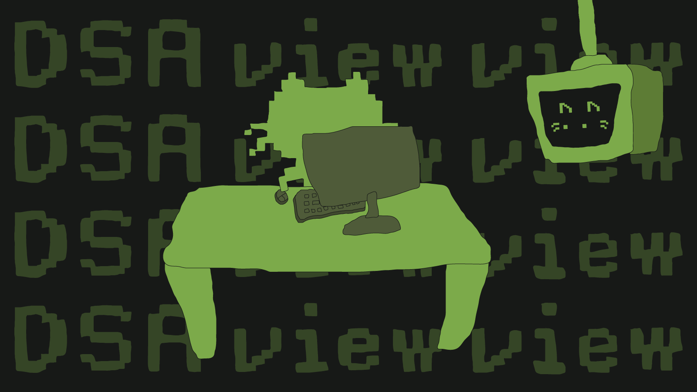

# DSA View View

DSA View View turns TypeScript algorithm functions into step-by-step visual
stories. 👀👀

Write code, run it with structured inputs, and see the arrays, matrices,
trees, lists, stacks, pointers, and return values move as the function executes.

It is built for those moments when reading the code is not enough and you want
to _see_ why the answer changes.

[](https://dsa-view-view.vercel.app/)

## Why Try It?

- 🧠 **Step through real TypeScript**<br />
  Paste or edit a function, validate it, then run the exact code in the browser.

- 🧩 **Views that match the data**<br />
  Arrays become bars, matrices become grids, trees become node graphs, linked
  lists become chains, and two-pointer area problems get their own visual view.

- 🌳 **DSA-friendly inputs out of the box**<br />
  `TreeNode`, `ListNode`, nested arrays, matrices, strings, numbers, and class
  style inputs are supported without ceremony.

- 🔎 **39 built-in examples**<br />
  Search by name, browse by category, and jump into classics like Two Sum,
  Binary Search, Build Tree, Number of Islands, Container With Most Water, and
  more.

- 🔗 **Share the exact moment**<br />
  Create a tokenized share URL for the current example, code, input, mode, and
  runtime step.

- 📺 **A tiny monitor friend**<br />
  ViewView reacts while you validate, wait, run, and finish algorithms.

## What It Feels Good For

- Debugging a LeetCode-style solution visually
- Explaining recursion, pointers, and data structures to someone else
- Checking how a default example evolves frame by frame
- Sharing a specific algorithm state without recording a video
- Turning "I think I get it" into "I can see it"

## Built-In Example Categories

Hash Map, Binary Search, Array, Sorting, Stack, Two Pointers, Dynamic
Programming, Backtracking, Matrix, Graph, Binary Tree, and Linked List.

## Local Setup

```bash
pnpm install
pnpm dev
```

Then open the local URL printed by Vite+.

Useful commands:

```bash
pnpm test
pnpm lint
pnpm build
```

## Tech

DSA View View is a browser-only `React` + `TypeScript` app powered by `Vite+`, `Monaco Editor`, `Babel`, `Tailwind CSS`, `Radix UI`, and `Framer Motion`.

User code runs locally in a dedicated Web Worker.
It cannot directly access the page DOM or local/session storage, and there is no server-side code execution.

## Current Scope

The current release focuses on synchronous TypeScript DSA functions: arrays, matrices, strings, numbers, objects, recursion, trees, linked lists, graphs, and common class-style interview inputs.

It does not try to be a full IDE.
Async code, arbitrary package imports, accounts, cloud saving, and multi-language execution are intentionally outside the first release scope.

---

If the algorithm is hard to picture, let's make it visible. 👀👀
